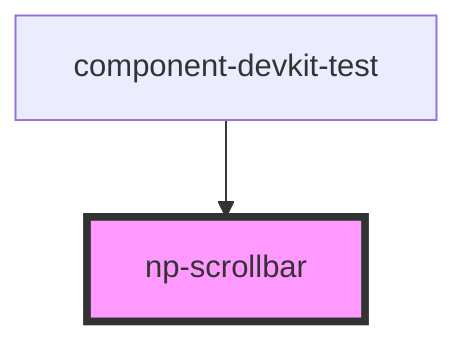

# np-scrollbar

<!-- Auto Generated Below -->

## Properties

| Property     | Attribute    | Description                                        | Type      | Default |
| ------------ | ------------ | -------------------------------------------------- | --------- | ------- |
| `disabled`   | `disabled`   | Enable or disable the scrollbar                    | `boolean` | `false` |
| `fullHeight` | `fullheight` | Enable or disable the full height on the scrollbar | `boolean` | `false` |
| `padding`    | `padding`    |                                                    | `number`  | `6`     |

## Methods

### `scrollToPosition(x?: number, y?: number, isPercentage?: boolean) => Promise<void>`

#### Parameters

| Name           | Type      | Description |
| -------------- | --------- | ----------- |
| `x`            | `number`  |             |
| `y`            | `number`  |             |
| `isPercentage` | `boolean` |             |

#### Returns

Type: `Promise<void>`

## Dependencies

### Used by

 - [component-devkit-test](../component-devkit-test)

### Graph

----------------------------------------------

*Built with [StencilJS](https://stenciljs.com/)*
